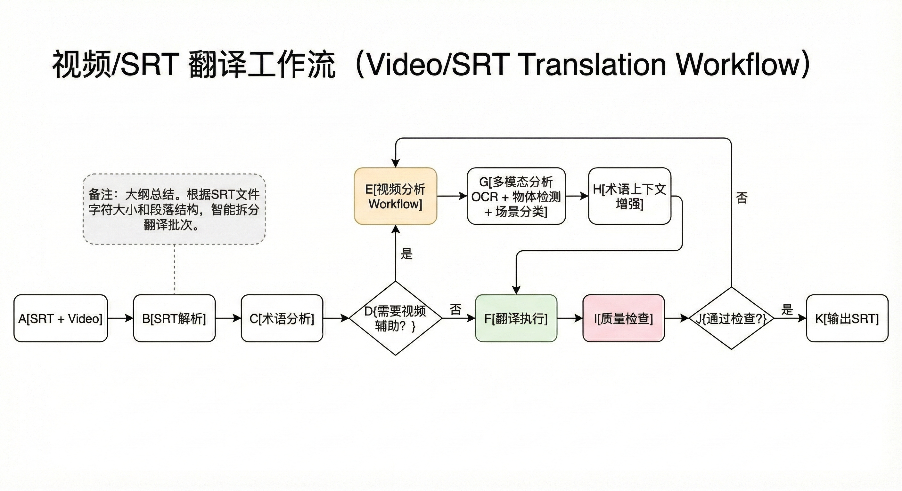
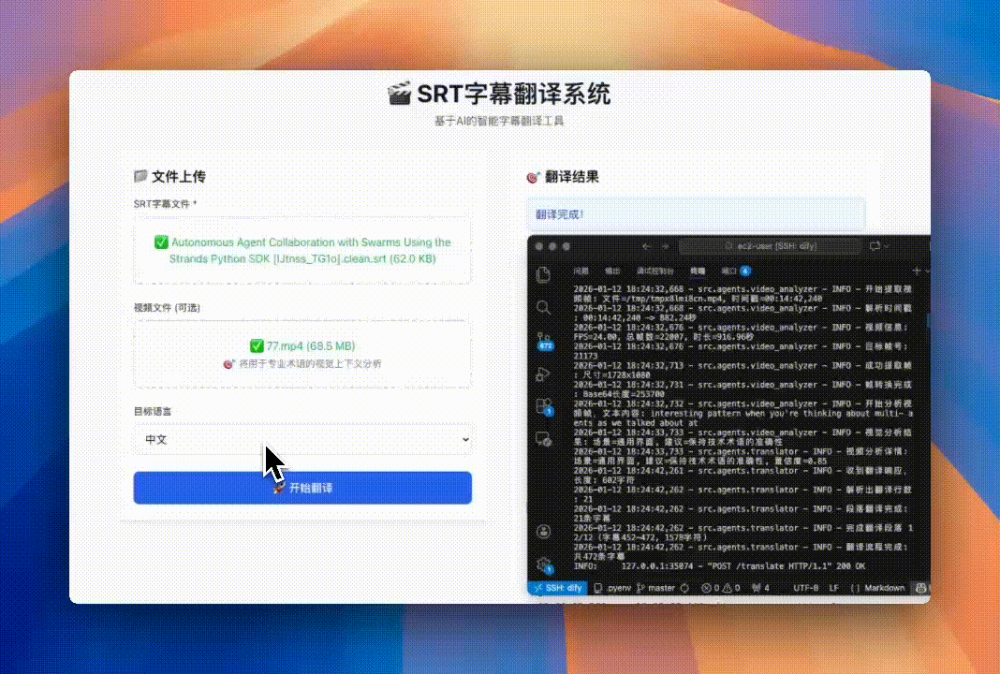

# MultiAgent-Subtitle-Translator

## 简介

这是一个基于 Strands Agent 多智能体框架开发的SRT字幕翻译系统演示。系统采用多Agent协作模式，每个Agent负责特定的翻译任务，实现高质量的智能字幕翻译。

### 系统智能体

- **SRT Parser Agent** - 解析SRT文件结构和格式
- **Terminology Analyzer Agent** - 分析和识别专业术语
- **Translator Agent** - 执行LLM翻译，支持视频上下文分析
- **Video Analysis Agent** - 视频帧提取和视觉上下文分析
- **Quality Controller Agent** - 翻译质量检查和验证
- **Format Reconstructor Agent** - 重构和格式化输出SRT文件
- **Orchestrator** - 协调和管理整个翻译流程

## 流程图



## 演示视频



## 快速开始

### 环境要求
- Python 3.9+
- Node.js 16+
- OpenCV (用于视频处理)

### 安装依赖

#### 后端
```bash
cd backend
pip install -r requirements.txt
```

#### 前端
```bash
cd frontend
npm install
```

### 配置

1. 复制配置文件并修改LLM设置：
```bash
cp config.py.example config.py
```

2. 编辑 `config.py` 设置你的LLM API：
```python
LLM_BASE_URL = "your-llm-api-url"
LLM_API_KEY = "your-api-key"
LLM_MODEL = "your-model-name"
```

### 启动应用

#### 方式1: 一键启动
```bash
./start.sh
```

#### 方式2: 分别启动
```bash
# 启动后端
cd backend && uvicorn main:app --reload --host 0.0.0.0 --port 8000

# 启动前端
cd frontend && npm start
```

### 访问应用
- 前端界面: http://localhost:3001
- 后端API: http://localhost:8000
- API文档: http://localhost:8000/docs

## 使用方法

1. **上传文件**
   - 拖拽或选择SRT字幕文件
   - 可选：上传对应的视频文件（用于专业术语的视觉上下文分析）

2. **选择目标语言**
   - 从下拉菜单选择目标翻译语言

3. **开始翻译**
   - 点击"开始翻译"按钮
   - 实时查看各Agent工作状态
   - 观察视频分析Agent在检测到专业术语时的工作过程

4. **下载结果**
   - 翻译完成后下载翻译后的SRT文件

## 技术栈

### 后端
- **FastAPI** - 现代Python Web框架
- **WebSocket** - 实时通信
- **OpenCV** - 视频处理
- **Strands Agents** - 多智能体框架

### 前端
- **React 18** - 用户界面
- **TypeScript** - 类型安全
- **Tailwind CSS** - 样式框架
- **Axios** - HTTP客户端

## 许可证

MIT License
